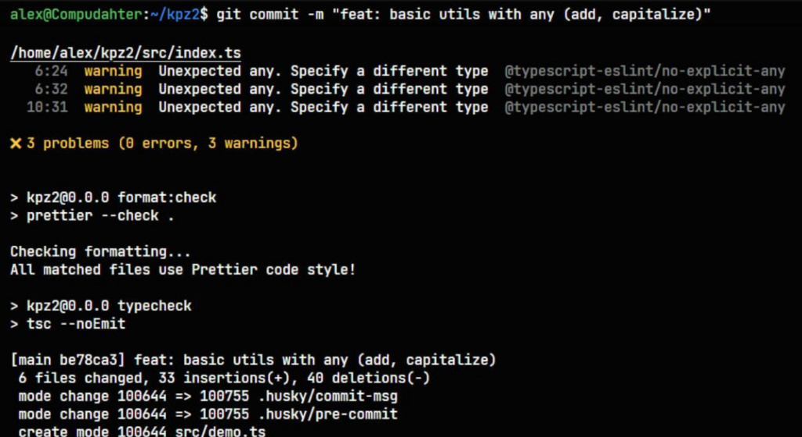
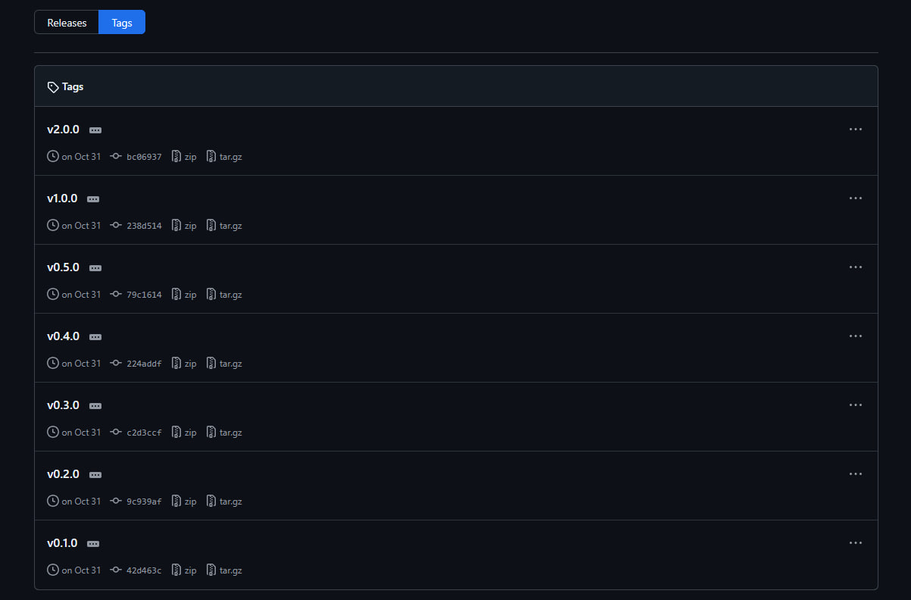
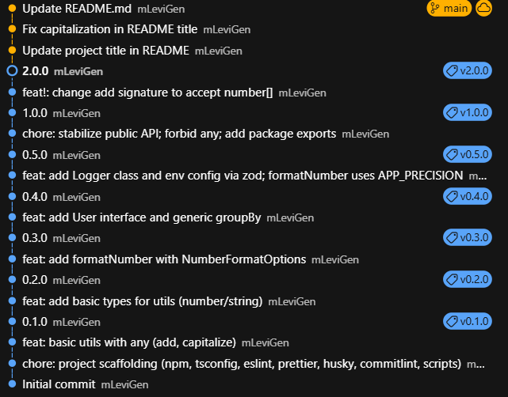
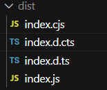

# Лабораторно-практична робота №2
## Робота з package.json, залежностями, змінними оточення, семантичним версіонуванням, базовими можливостями TypeScript (type, interface, class).

## Мета
- Ознайомитися зі структурою package.json та призначенням основних полів.
- Навчитися відрізняти робочі залежності (dependencies) від залежностей для розробки (devDependencies).
- Розібратися з принципами семантичного версіонування (SemVer) і навчитися оновлювати версії коректно.
- Дослідити використання змінних оточення через .env файли та підключення їх у коді.
- Освоїти базові конструкції TypeScript: типи, інтерфейси, класи, generics.
- Налаштувати інструменти перевірки коду: ESLint, Prettier, Husky, Commitlint.
- Закріпити практику роботи з Git та GitHub (ініціалізація репозиторію, коміти, теги версій).

## Husky хуки

## Проєкт пройшов повний цикл еволюції від версії 0.1.0 до 2.0.0. Кожен крок зафіксовано відповідним комітом.

## Послідовність релізів

## npm run build створює dist/ з CJS/ESM і .d.ts.

В ході роботи була створена навчальна TypeScript-бібліотека, яка містить набір утиліт для роботи з даними (числами, рядками, масивами) та систему логування. Проєкт демонструє повний цикл розробки: від ініціалізації та суворої типізації до автоматизації перевірок перед комітами та керування версіями через Git-теги.
